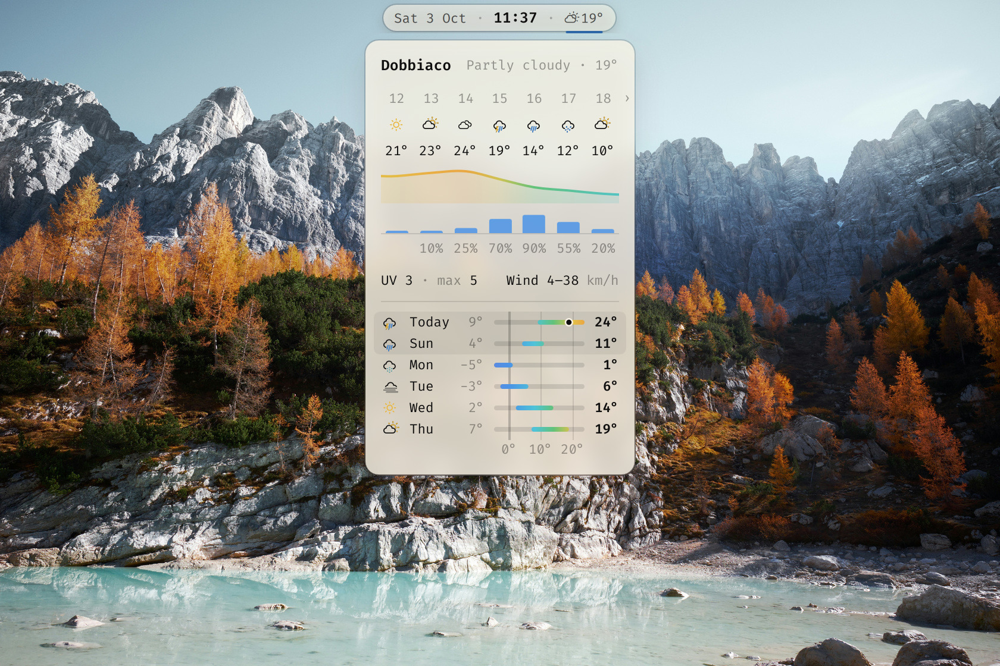

# Weather for the Omarchy bar

Glyph and temperature in the bar. Hover for a forecast card: the next 24
hours with a temperature curve and chance of rain, today's UV and wind, then
the week as temperature range bars.



Data from [wttr.in](https://wttr.in) and [Open-Meteo](https://open-meteo.com).
No API key.

## Install

Needs Omarchy 4, `curl`, `jq` and a Nerd Font in the bar.

```sh
git clone https://github.com/JojoSc/omarchy-weather-widget
cd omarchy-weather-widget
./install.sh
grep -qs omarchy-bar-weather ~/.config/hypr/looknfeel.lua \
  || cat hypr/weather.lua >> ~/.config/hypr/looknfeel.lua   # frosted card
omarchy restart shell
```

`install.sh` puts the module after the clock and takes Omarchy's own weather
pill off the bar (`omarchy bar put omarchy.weather` brings it back).
`./install.sh --help` lists the options.

## Use

- Hover opens the card, left click pins it, right click refreshes.
- Scroll on the card for later hours.
- `omarchy-shell weather toggle` works from a keybinding.
- `export OMARCHY_WEATHER_LOCATION="New York"` in `~/.bash_profile` picks the
  place; `.bashrc` and exports in a terminal do not reach the bar. The
  default is your IP's location.

Written for my own clone of the bar plugin. On the stock bar the card is
plain, white or dark to suit the bar's text, and sits under the label.

[MIT](LICENSE)
