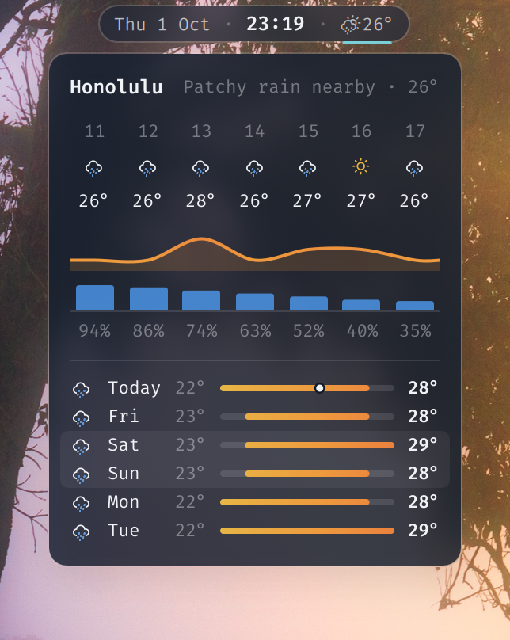
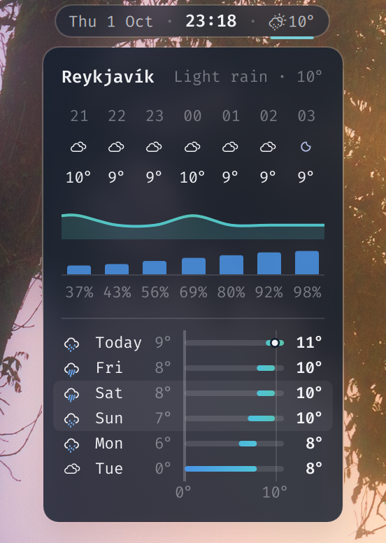
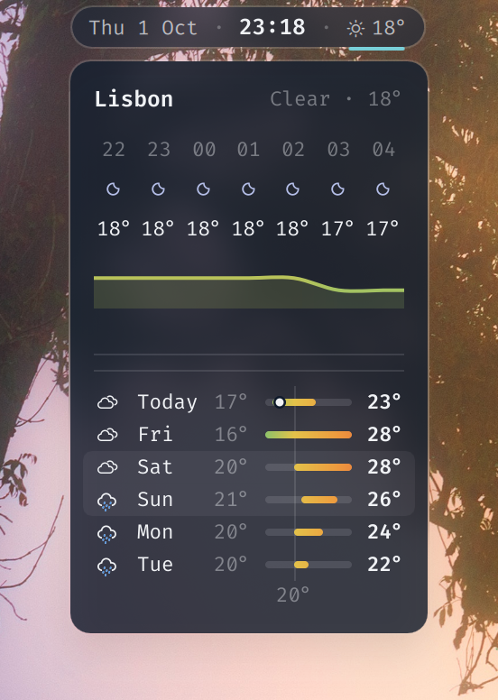
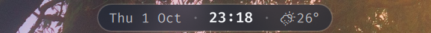

# Weather for the Omarchy bar

A weather module for the [Omarchy](https://omarchy.org) shell bar. In the bar
it is a glyph and the temperature. Rest the pointer on it and a forecast card
drops under the island: the place and the current conditions, the next seven
hours with a temperature curve and the chance of rain, then the week as
temperature range bars on one shared scale, the way the iOS Weather app draws
them.

<p align="center">
  
</p>

<p align="center">
  
  &nbsp;&nbsp;
  
</p>

Weather comes from [wttr.in](https://wttr.in) (the place, by IP unless you set
one, and the current conditions) and [Open-Meteo](https://open-meteo.com)
(the hourly and daily forecast). Neither needs an API key or an account.

## What it does

**In the bar**

- A Nerd Font weather glyph and the temperature, polled every five minutes.
- Hover for 150 ms and the card opens; it stays while the pointer is on the
  label or the card and closes 300 ms after it leaves both.
- Left click pins the card (the next click outside closes it). Right click
  drops the cache and refetches.
- `omarchy-shell weather toggle | open | close | refresh | isOpen` does the
  same from a keybinding.
- With no forecast to show (offline, first run) hover falls back to a plain
  tooltip.

<p align="center">
  
</p>

**On the card**

- Header: the place, and the conditions with the temperature.
- The next seven hours as one grid: hour, condition glyph (day or night
  variant), temperature. Under it a temperature curve coloured by
  temperature, and chance-of-rain bars with the percentage from 10 % up. The
  rain row disappears on a dry day.
- Today and the next five days: glyph, name, low, a temperature range bar,
  high. All bars share one track from the week's coldest low to its warmest
  high, each day's pill covers its own range, coloured on a cold-to-hot scale
  (indigo, blue, teal, green, yellow, orange, red). Today's pill carries a
  dot at the current temperature. Thin axis lines mark every 10° inside the
  range (0° and 30° heavier), labelled under the last row. Weekend days sit
  on a faint band.
- Glyphs are two-tone like the iOS icons: clouds in the text colour, only the
  sun, moon, drops, flakes, bolt and fog lines take colour. The font glyphs
  are single-colour, so the coloured part is the same glyph drawn again and
  clipped.
- The card takes its colours and font from the bar, so it follows the theme.
  With the Hyprland rule in `hypr/weather.lua` it is frosted: blurred
  background at 80 % with a soft shadow.

## Files

| Path | What |
|---|---|
| `bar/modules/weather.qml` | The bar module: runs the script, renders the label, owns hover, pin, click and IPC. |
| `bar/modules/weather/WeatherPopup.qml` | The forecast card: a layer surface placed under the island, all drawing. |
| `bar/scripts/weather.sh` | Fetches wttr.in and Open-Meteo, caches both for 15 minutes, prints one JSON line (Waybar-style `text`/`tooltip` plus a `popup` payload). |
| `hypr/weather.lua` | The Hyprland layer rule that blurs the card. |
| `install.sh` | Copies the files into `~/.config/omarchy` and adds the module to `shell.json`. |

## Install

Needs Omarchy 4 (its shell is a Quickshell instance; written against 4.0.4
with Quickshell 0.3.1 and Qt 6.11), `curl` and `jq`, and a Nerd Font as the
bar font for the weather glyphs. Omarchy's default fonts are Nerd Fonts.

```sh
git clone https://github.com/JojoSc/omarchy-weather-widget
cd omarchy-weather-widget
./install.sh
```

The script copies the three files under `~/.config/omarchy/bar/`, then adds
the module to the centre section of `~/.config/omarchy/shell.json` right
after the clock (`--section right` for another section, `--no-layout` to
skip this). It backs the file up first and removes Omarchy's own
`omarchy.weather` pill from the layout, so the two do not sit side by side.

Then, for the frosted look, append `hypr/weather.lua` to
`~/.config/hypr/looknfeel.lua` (or wherever your layer rules live) and
restart the shell:

```sh
cat hypr/weather.lua >> ~/.config/hypr/looknfeel.lua
omarchy restart shell
```

By hand instead: copy the files to the same paths and put this entry into a
section of `bar.layout` in `shell.json`:

```json
{ "id": "weather", "type": "qml", "source": "~/.config/omarchy/bar/modules/weather.qml" }
```

## Configure

- **Place.** Set `OMARCHY_WEATHER_LOCATION` to anything wttr.in accepts
  (`Berlin`, `50.11,8.68`, an airport code). The shell inherits Hyprland's
  environment, so `hl.env("OMARCHY_WEATHER_LOCATION", "Berlin")` in your
  Hyprland Lua config does it (reload Hyprland, then `omarchy restart
  shell`); `~/.bash_profile` works too, the script runs in a login shell.
  Unset, wttr.in picks the place from your IP.
- **Size.** `"fontSize": 13` on the `shell.json` entry scales the label.
- **How much forecast.** `HOURS=7` and `DAYS=5` at the top of `weather.sh`;
  the card grows with them. `MAX_AGE=900` is the cache lifetime in seconds,
  the poll interval is the `Timer` in `weather.qml` (300 000 ms).
- **Keybinding.** Bind a key to `omarchy-shell weather toggle` for a pinned
  card without the mouse.

## Note on the bar

The card asks the bar for a few things the stock custom-module API does not
hand out: `islandBase` and `islandBorder` for its colours, `islandTop`,
`islandHeight` and the island item for placement, `capShift` to centre
digits on their line, `barFontSize` and `barFontSizeStrong`, and
`requestHoverCard` / `releaseHoverCard` so only one hover card is up at a
time. Those come from my own clone of the bar plugin (the one with islands
in the screenshots). On the stock `omarchy.bar` each of them has a fallback:
the card is white at 80 %, hangs centred under the temperature label and uses
default sizes. It works, it just matches the theme less closely.

## Credits

Layout after the iOS Weather app. Weather data by [wttr.in](https://wttr.in)
and [Open-Meteo](https://open-meteo.com). Glyphs from
[Nerd Fonts](https://www.nerdfonts.com).

## License

[MIT](LICENSE)
